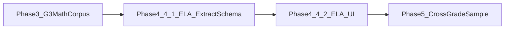

# Curriculum Phased Rollout Plan (Unit-to-Grade-8)

**Purpose:** Define strict phase boundaries, completion criteria, and expansion strategy so implementation remains controlled and measurable.

## Program objective

Deliver a curriculum pipeline that is:
- extraction-faithful,
- provenance-complete,
- UI-clear for teachers,
- robust across unit templates and subjects,
- ready to scale through Grade 8.

## Plan amendment (2026-03-28)

This amendment refines **Phase 3** and **Phase 4** without renumbering later phases.

- **Track A — Grade 3 Math:** Phase 3 now includes parser and `SubjectConfig` refinement **and** completion of the **full Grade 3 Math ingest corpus** (see Phase 3 for the checkable definition). Each unit run produces `ingest_reports/` artifacts, `verify_curriculum_db.py` verification where applicable, and evidence under `docs/curriculum/acceptance-evidence/`. This corpus completion is **not** the same as **program-wide** bulk ingestion across all grades and subjects (still gated at [Decision checkpoint: when to start broad ingestion](#decision-checkpoint-when-to-start-broad-ingestion)).

- **Track B — ELA:** Phase 4 is expanded into **two substages**: **4.1** extraction and DB/API contract, then **4.2** navigator UI template. SSOT and code touchpoints include [docs/scrapers/CURRICULUM_EXTRACTION_ARCHITECTURE.md](../scrapers/CURRICULUM_EXTRACTION_ARCHITECTURE.md), [tools/scraper/ela_summary_table.py](../../tools/scraper/ela_summary_table.py), [tools/scraper/ela_lesson_plan_table.py](../../tools/scraper/ela_lesson_plan_table.py), and [lesson-plan-browser/frontend/src/components/CurriculumExplorer.tsx](../../lesson-plan-browser/frontend/src/components/CurriculumExplorer.tsx).

- **Tooling vs curriculum git hygiene:** Optional cross-app build/TS tweaks for the lesson-plan browser ship from a dedicated tooling branch; phase branches merge on ingest/API/UI scope. See [Addendum: lesson-plan-browser build and branch hygiene (2026-03-29)](#addendum-lesson-plan-browser-build-and-branch-hygiene-2026-03-29).

- **Default sequence:** Complete **Phase 3** (including the G3 Math corpus) **before Phase 4.1**, so shared ingest and API fixes stabilize first. **ELA UI spikes** in parallel are allowed only as **non-mergeable prototypes** unless they stay behind a feature flag or branch that does not land before 4.1 exits.

## Mandatory phase git and quality workflow

Every phase must follow this sequence:

1. **Create phase branch**
   - naming: `curriculum/phase-<n>-<short-scope>`
2. **Implement only in-scope work**
   - no out-of-scope coding inside the phase branch
3. **Run phase test gate**
   - required tests defined in phase checklist
4. **Refactor pass (if tests pass)**
   - apply minimal refactors aligned to DRY/SOLID and current phase scope
5. **Run tests again**
   - same suite must pass after refactor
6. **Merge and push**
   - merge to integration branch/main process
   - push to GitHub only after both test passes are green

If step 3 fails, do not proceed to refactor or merge.

## Addendum: lesson-plan-browser build and branch hygiene (2026-03-29)

This addendum records **repository practices** that support phased curriculum work but are **not** themselves phase-scoped curriculum features. They complement [PHASE_EXECUTION_TEMPLATE.md](./PHASE_EXECUTION_TEMPLATE.md).

### Keep phase branches current

- Periodically **merge or rebase** from `master` (or the agreed integration branch) into active `curriculum/phase-*` branches so work does not drift behind unrelated commits and comparisons stay fair.

### Clean commits and noise control

- Phase PRs should include **in-scope** source, tests, and `docs/curriculum/acceptance-evidence/` entries (and registry/docs SSOT updates) only when the phase calls for them.
- Do **not** commit throwaway scripts, local database or WAL files, informal one-off `ingest_reports/` JSON, or scratch artifacts unless a phase checklist explicitly names them as evidence. When a clutter pattern repeats, extend [`.gitignore`](../../.gitignore).

### Cross-cutting tooling branch (optional)

- **Cross-app TypeScript / npm build defaults** under `lesson-plan-browser/frontend/` (for example: default `npm run build` = `vite build`, optional `npm run build:typecheck` = `tsc && vite build`, `package.json` overrides such as pinned `csstype`, `tsconfig` `types` alignment) may ship from a **dedicated** branch (e.g. `tooling/lesson-plan-browser-typescript-graph`) and merge via a **small PR to `master`**, separate from a `curriculum/phase-*` PR so curriculum reviews stay focused on ingest, API, and explorer behavior.

### Lesson-plan-browser build commands (SSOT for this repo)

| Command | Purpose |
|--------|---------|
| `npm run build` | **Supported production bundle** for `lesson-plan-browser/frontend` (`vite build`). Use for manual regression and desktop packaging flows that invoke this script. |
| `npm run build:typecheck` | Optional: runs `tsc && vite build`. A green full-project `tsc` across `shared/*`, cross-imported `frontend/*`, and multiple `node_modules` layouts is **follow-up technical debt**; it is **not** a mandatory curriculum phase gate in this plan unless a future amendment adds it to CI. |

### Working tree discipline when switching branches

- Git uses a **single** working tree. Before `git checkout` between `curriculum/phase-*` and `tooling/*` (or whenever the tree mixes large unrelated WIP), **commit** in logical slices or use **`git stash push`** with a clear message so a tooling branch checkout does not show phase-only edits as modified tracked files.
- Periodically review **`git stash list`** and drop or apply stale entries so old stashes do not mask real state.

## Mandatory end-of-phase wrap-up

At the end of each phase, close the session with:

1. Phase result: `PASS` or `BLOCKED`.
2. One-line summary of what was completed.
3. List of blockers (if any), max 3 bullets.
4. Evidence paths (tests, reports, screenshots).
5. **Very short next-phase trigger prompt** saved in session notes.

### Next-phase trigger prompt format

Use this exact short format:

`Start Phase <N>: execute docs/curriculum/PHASE_EXECUTION_TEMPLATE.md for <phase-scope>, run test gate #1, implement in-scope only, and report PASS/BLOCKED with evidence paths.`

## End-of-phase refactor protocol (from docs/refactor)

At the end of each implementation phase, apply refactoring practices from:
- `docs/refactor/GIT_DURING_REFACTORING.md`
- `docs/refactor/REFACTORING_TOOLS_FOR_CURSOR.md`
- `docs/refactor/REFACTORING_PRIORITIES_AND_TOOLS.md`
- `docs/refactor/LOC_AND_METRICS.md`

Required end-of-phase sequence:

1. Identify touched files that are good refactor candidates.
2. If a touched file has a plan in `docs/refactor/plans/`, follow that plan strictly.
3. Keep refactor commits small and atomic (one extraction/purpose per commit).
4. Run focused tests before each refactor commit.
5. Run full phase test gate after refactor sequence.
6. Refresh LOC snapshot:
   - `python tools/refactor/count_loc.py --markdown`
7. Update refactor tracking docs if changed in this phase:
   - progress summary and done notes in `docs/refactor/REFACTORING_PRIORITIES_AND_TOOLS.md`
8. Merge and push only after all tests remain green.

## Program end state

This phase series ends when all of the following are true:
- quality gates pass on a representative cross-grade/cross-subject sample set (through Grade 8),
- parser variance is controlled with documented fallback behavior,
- provenance and run reports are always present,
- navigator UX supports lesson/unit progression and cross-grade semantic links,
- regression suite is stable enough for routine ingestion expansion.

After that, the project transitions from "hardening" to "production expansion" (bulk ingestion and continuous onboarding of units).

---

## Phase definitions

## Phase 0 - Program lock and baseline

**Goal:** Freeze target scope, baseline behavior, and acceptance artifacts before major changes.

**Sub-stage (Phase 0):** Prior-art and external landscape research — time-boxed review of GitHub/Stack Overflow and related material against our end-to-end extraction and ingestion pipeline. **Topic map, deliverables, and integration rules:** [`docs/curriculum/PRIOR_ART_RESEARCH_SUBSTAGE.md`](./PRIOR_ART_RESEARCH_SUBSTAGE.md). **Output home:** [`docs/curriculum/research-notes/`](./research-notes/).

**In scope**
- Confirm target acceptance unit and source IDs.
- Baseline ingest output, API payloads, and UI screenshots.
- Finalize quality gates and acceptance protocol.
- Complete the Phase 0 research sub-stage memo and source log (see sub-stage checklist exit criteria in `PRIOR_ART_RESEARCH_SUBSTAGE.md`).

**Out of scope**
- New parser features not tied to baseline correctness.
- Broad multi-unit ingestion.

**Exit criteria**
- Baseline evidence archived.
- No unresolved ambiguity in quality gates.
- Research sub-stage evidence archived under `docs/curriculum/research-notes/` (memo + sources + **reflexive review memo** per `PRIOR_ART_RESEARCH_SUBSTAGE.md`).
- Branch `curriculum/phase-0-baseline` merged and pushed after phase tests.

---

## Phase 1 - Provenance and fidelity foundation

**Goal:** Make one unit fully traceable and fidelity-verified end-to-end.

**In scope**
- Persist provenance metadata (unit + lesson).
- Expose provenance in API and UI source panel.
- Emit ingest run manifest in `ingest_reports/`.
- Pass all gates for one target unit.

**Out of scope**
- Full navigator search/index.
- Cross-grade linking automation.

**Exit criteria**
- `Unit-Complete` status for target unit with evidence.
- Branch `curriculum/phase-1-provenance-fidelity` merged and pushed only after:
  - phase tests pass,
  - refactor pass is complete,
  - tests pass again.

---

## Phase 2 - Unit intro parity and UX navigation hardening

**Goal:** Remove UX ambiguity and ensure unit intro quality equals lesson quality.

**In scope**
- Unit intro extraction parity and validation.
- Top navigation model (breadcrumb, previous/next lesson, previous/next unit).
- Ensure selected lesson context appears near top immediately.

**Out of scope**
- Full semantic search and recommendation ranking.

**Exit criteria**
- Teacher navigation acceptance passes for target unit.
- Branch `curriculum/phase-2-intro-ux` merged and pushed after double-pass tests (pre/post refactor).

---

## Phase 3 - Grade 3 Math template resilience and full corpus

**Goal:** Prove robustness within Grade 3 Math, then ingest **every in-scope Grade 3 Math unit** before cross-subject ELA hardening.

**Corpus definition (checkable)**  
- **SSOT for unit tabs:** [reference_docs/scraped_registry.json](../../reference_docs/scraped_registry.json) → `Grade 3` → `Math`.  
- At **Phase 3 kickoff**, archive a short **ingest checklist** under `docs/curriculum/acceptance-evidence/` listing each registry key targeted for full `ingest_to_curriculum` (and any explicit exclusions, e.g. benchmark-only tabs if not lesson guides).  
- **100% corpus complete** means every checklist row has a passing ingest (or documented failure with `FAILURE_TAXONOMY` classification and owner), matching `units` rows with `grade = 3` and `subject = 'Math'` for those units.

**In scope**
- Parser and [tools/scraper/table_extractor.py](../../tools/scraper/table_extractor.py) / [SubjectConfig](../../tools/scraper/subject_config.py) tuning for Grade 3 Math, with evidence from **multiple** unit patterns (the corpus ladder subsumes “at least 2 additional units”).
- Expand regression checks for heading variants and section drift.
- Tune parser heuristics only where evidence supports changes.
- Per unit: `ingest_reports/` artifact; run `python tools/scraper/verify_curriculum_db.py --ingest-report ingest_reports/<run_id>.json` when the gate ties to that ingest; archive acceptance notes.
- **Regression sampling after shared-parser changes:** rerun or spot-check at least **one non–Grade-3 Math** unit and **one ELA** sample so Math-only tuning does not silently break other subjects.

**Out of scope**
- Grade 3 ELA onboarding beyond the regression smoke sample above.
- Grade 4+ Math bulk ingest.

**Exit criteria**
- **100%** of the Phase 3 G3 Math checklist ingested per the corpus definition; critical gates pass; no unresolved critical parser regressions on the regression samples.
- Branch `curriculum/phase-3-g3-math-corpus` merged and pushed after required phase test gate, refactor pass (if any), and second test gate per the mandatory workflow.  
  *(Earlier branch name `curriculum/phase-3-template-resilience` is superseded by this scope.)*

---

## Phase 4 - ELA hardening (extraction, then UI)

**Goal:** Stabilize ELA extraction into SQLite/API, then deliver a **subject-aware** curriculum navigator template for ELA (without forcing ELA into Math procedure banding).

**Branching policy:** Use **one** branch `curriculum/phase-4-ela-hardening` with **two internal milestones**: complete **4.1** (test gate + evidence) before merging **4.2** UI work on the same branch, or merge 4.1 first and continue 4.2 in a follow-up commit series on that branch—either way, **two test gates** (pre/post refactor) apply to the phase as a whole before final merge. Older session notes may mention `curriculum/phase-4-cross-subject`; that name is obsolete—use `curriculum/phase-4-ela-hardening`.

### Phase 4.1 - ELA extraction and DB contract

**In scope**
- Stabilize JSON shapes and `schema_version` for `ela_key_learning_summary` and `ela_lesson_plan_structured`; golden tests in [tests/test_ela_summary_table.py](../../tests/test_ela_summary_table.py) and [tests/test_ela_lesson_plan_table.py](../../tests/test_ela_lesson_plan_table.py).
- Ingest **representative** Grade 3 ELA sample unit(s); validate standards/procedure boundaries for ELA-specific patterns; compare fidelity and section coverage against the Math baseline where comparable.
- Update or add scraper SSOT under `docs/scrapers/` as needed.

**Design guardrail (modular ingest)**
- Keep a **single** `ingest_to_curriculum` orchestration path; extend behavior via [SubjectConfig](../../tools/scraper/subject_config.py) and **subject-specific modules** (e.g. [ela_summary_table.py](../../tools/scraper/ela_summary_table.py), [ela_lesson_plan_table.py](../../tools/scraper/ela_lesson_plan_table.py)).
- Prefer **new or extracted subject modules** over large subject-specific branches inside [table_extractor.py](../../tools/scraper/table_extractor.py) when adding parsers.
- **Presentation:** subject-specific Curriculum Explorer rendering stays in dedicated branches/components in the UI; shared types come from API payloads only.

**Out of scope**
- Full cross-grade ELA matrix (Phase 5).
- Navigator UI restyle beyond what is required to verify API payloads (defer to 4.2).

**Exit criteria**
- Sample ELA unit(s) pass the same **quality gates** as Math for schema, provenance, and ELA-specific fields; no critical defects.
- Evidence paths recorded under `docs/curriculum/acceptance-evidence/`.

### Phase 4.2 - ELA navigator UI template

**In scope**
- Subject-aware lesson detail in [lesson-plan-browser/frontend/src/components/CurriculumExplorer.tsx](../../lesson-plan-browser/frontend/src/components/CurriculumExplorer.tsx): branch on subject or payload; render structured ELA sections (summary matrix JSON, detailed plan JSON) without mapping ELA into Math-only procedure segment UI unless the content truly matches.
- Teacher-facing acceptance checklist or screenshots in `docs/curriculum/acceptance-evidence/`.

**Out of scope**
- FTS5 / full search UX (Phase 6).
- Cross-grade ELA expansion (Phase 5).

**Exit criteria**
- UX acceptance for ELA lesson view; regression check on **one** Math lesson still renders correctly.
- Branch `curriculum/phase-4-ela-hardening` merged and pushed after passing phase tests twice (before and after refactor) per mandatory workflow.
- For manual verification of the explorer bundle, run `npm run build` under `lesson-plan-browser/frontend` (see [Addendum: lesson-plan-browser build and branch hygiene (2026-03-29)](#addendum-lesson-plan-browser-build-and-branch-hygiene-2026-03-29)).

---

## Phase 5 - Cross-grade representative sample (through Grade 8)

**Goal:** Build confidence that code is robust enough for broad ingestion.

**In scope**
- Curate representative sample matrix across Grades 2-8.
- Include high-variance templates and edge-case structures.
- Track pass/fail rates and parser exception classes.
- For **ELA** samples, exercise **both** the Summary of Key Learning matrix (`ela_key_learning_summary`) and per-lesson detailed table JSON (`ela_lesson_plan_structured`) where the source document provides them—plus the Phase 4.2 UI template on at least one sample per variance class.

**Out of scope**
- Bulk ingest all available units (program-wide).

**Exit criteria**
- Sample matrix meets target pass threshold (see below).
- Branch `curriculum/phase-5-cross-grade-sample` merged and pushed only when all sampled rows meet gate policy.

---

## Phase 6 - Navigator and semantic progression features

**Goal:** Deliver pedagogical browsing improvements once core fidelity is stable.

**In scope**
- FTS5 (or approved search index) with highlighted results.
- Cross-grade semantic unit links (manual + assisted suggestions).
- Rationale display for related-unit links.

**Out of scope**
- Advanced autonomous agent planning features.

**Exit criteria**
- Teacher can navigate lesson progression and grade-to-grade progression clearly.
- Branch `curriculum/phase-6-navigator-semantic-links` merged and pushed after stable UX and regression tests.

---

## Phase 7 - Expansion readiness and controlled scale-up

**Goal:** Start broader ingestion with safety controls.

**In scope**
- Bulk onboarding in batches with run reports and rollback path.
- Continuous QA monitoring for newly ingested units.
- Maintenance cadence for parser and subject configs.

**Exit criteria**
- Transition to continuous ingestion mode approved.
- Branch `curriculum/phase-7-expansion-readiness` merged and pushed with operational signoff.

---

## Representative sampling strategy

## Stage A - Initial hardening sample (culminates in full G3 Math corpus)
- Grade 3 Math Unit 2 (anchor unit) and additional G3 Math units with different layout patterns during ladder hardening.
- **End state:** Stage A completes when Phase 3’s **full Grade 3 Math corpus** (per Phase 3 checklist tied to `scraped_registry.json` → `Grade 3` → `Math`) is ingested—not only three sample units.

## Stage B - Subject contrast (ELA structure + UI)
- Grade 3 ELA unit(s) that validate **structured fields** (`ela_key_learning_summary`, `ela_lesson_plan_structured`) and the **ELA navigator UI template** (Phase 4.2), not only a single flat sample.
- Grade 3 ELA Unit B (or additional units) if needed for template variance.

## Stage C - Vertical sample to Grade 8
- At least one Math and one ELA unit per grade cluster:
  - Grades 2-3
  - Grades 4-5
  - Grades 6-8
- Prioritize units with known structural variety and standards complexity.

## Pass threshold recommendation
- 100% pass on critical gates (schema, provenance, boundary correctness).
- >=95% pass on fidelity spot checks across sample lines.
- 0 unresolved critical defects before next stage.

---

## Governance and change control

- Any parser behavior change requires:
  - reason tied to failing gate,
  - before/after evidence,
  - rerun of impacted sample units.
- Failure classification must use `docs/curriculum/FAILURE_TAXONOMY.md` as SSOT.
- Ingest reports must include and preserve:
  - `primary_failure_code`
  - `secondary_failure_codes`
  - `ingest_stats`
- For gate runs tied to a specific ingest, run `python tools/scraper/verify_curriculum_db.py --ingest-report ingest_reports/<run_id>.json` so verification outcomes are written back to the same run artifact.
- No phase advancement with open critical defects.
- Keep all phase decisions and acceptance evidence in `docs/curriculum/acceptance-evidence/`.

## Good-practice compliance checklist (.cursor/rules aligned)

Before merging each phase branch, verify:

- **SSOT:** no duplicated truth source for schema, parser behavior, or metadata definitions.
- **DRY:** duplicated logic extracted where repetition is proven.
- **KISS:** simplest implementation that meets current phase scope.
- **YAGNI:** no speculative features beyond the phase definition.
- **SOLID:** parser, API, and UI responsibilities remain separated and focused.
- **Project architecture:** changes remain consistent with `README.md` architecture.

For refactor tasks that have a plan under `docs/refactor/plans/`, follow `refactoring-workflow.mdc`:
- one extraction per commit,
- run the plan test command before each commit.

---

## Decision checkpoint: when to start broad ingestion

**Grade 3 Math corpus (Phase 3)** is **allowed and expected** to complete **before** program-wide broad ingestion. Finishing all in-scope G3 Math units is **not** the same as unlocking bulk ingest for all grades and subjects.

**Program-wide / all-grades bulk ingestion** (beyond curated Phase 5 samples and Phase 3’s G3 Math scope) starts only after **Phase 5 and Phase 6** exit criteria pass:
- representative sample validated through Grade 8,
- search/navigation UX stable,
- provenance and regression controls fully operational.

Until then, ingestion outside Phase 3’s defined G3 Math corpus stays in **curated batches** only.

---

## Revisit: local-first document links (end of navigator implementation)

**Do not treat as a phase blocker for extraction/schema work** until Phase **4.2** (Explorer UI) is ready for integrated desktop testing.

Some environments still open **Google Drive** instead of a local export when clicking curriculum links, even after backend discovery and frontend intercept work. That is **documented as an open backlog** with hypotheses and a verification checklist:

- **[LOCAL_FIRST_LINKS_BACKLOG.md](LOCAL_FIRST_LINKS_BACKLOG.md)**

At the **end of the curriculum navigator implementation plan** (after Phase 4.2 stabilizes and real Tauri/proxy behavior can be measured), run the backlog checklist: confirm `/resolve` from the actual app origin, add diagnostics if needed, consider an ingest-time id→path index, and add Tauri “open with Word” only if still required after verifying `/file` behavior.

### Revisit: Math lesson portal URL vs. teacher guide PDF

**Separate from** the Google Drive local-first backlog: for **Math**, each lesson often exposes **two** links — (1) the **lesson title** pointing at the **live curriculum website** (e.g. IM / district portal), which must open **directly** and is **out of scope for scraping**, and (2) the **teacher guide** (often **PDF**), which should be **easy to find**, opened locally when already downloaded, and is a candidate for **future structured extraction** for pacing and generated plans.

Full requirements and future-work notes: **[MATH_LESSON_PORTAL_AND_TEACHER_GUIDE_UX.md](MATH_LESSON_PORTAL_AND_TEACHER_GUIDE_UX.md)**. Implement and acceptance-test in the **same integration pass** as other end-of-plan link and navigator work (not as a one-off during extraction-only phases).
