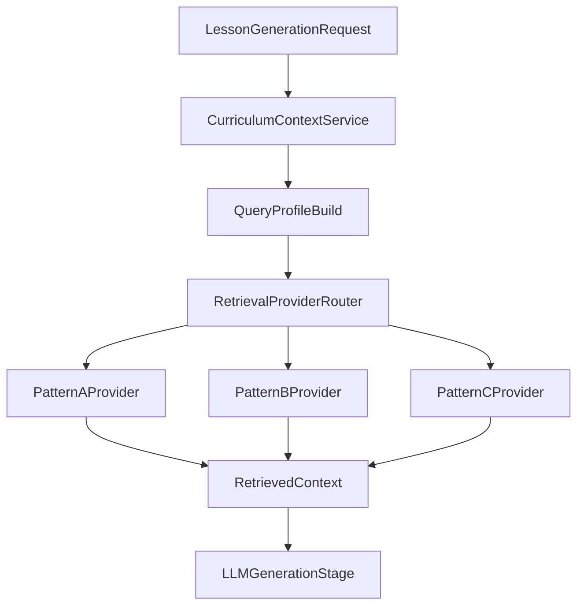

# Architecture Gate Option Matrix

Status: Draft for roadmap gate
Last updated: 2026-04-23

## Decision Context
This matrix compares three architecture patterns for traditional + vector retrieval, aligned to current roadmap contracts and local-first constraints.

## Patterns

### PatternA_CurrentPlusVectorSidecar
- Relational/system-of-record: `SQLite (local)` + `Supabase/PostgreSQL (cloud sync/backup)`.
- Retrieval: dedicated vector store (for example LanceDB/Qdrant) fed by JSON ETL.
- App contract: preserve `CurriculumContextService.retrieve_context` as the only retrieval entrypoint.

### PatternB_MariaDbPrimaryRelationalVector
- Relational/system-of-record: MariaDB as primary DB.
- Retrieval: MariaDB vector tables/indexes in same engine.
- App contract: still keep `retrieve_context`, but persistence/sync and data access layers are reworked around MariaDB.

### PatternC_HybridTransition
- Keep current relational stack for operational data.
- Introduce MariaDB only for curriculum retrieval/index pilot.
- Use adapters so retrieval provider can be switched after benchmark phase.

## Compatibility With Current Roadmap

| Criterion | PatternA | PatternB | PatternC |
|---|---|---|---|
| Aligns with current `README.md` storage direction | High | Low | Medium |
| Preserves local-first sync assumptions in `DATABASE_ARCHITECTURE_AND_SYNC.md` | High | Low-Medium | Medium-High |
| Preserves `retrieve_context` abstraction | High | Medium | High |
| Migration complexity | Low-Medium | High | Medium |
| Time to first measurable retrieval gains | Medium | Medium-High | Medium |
| Operational simplicity (near-term) | High | Medium-Low | Medium |
| Long-term single-engine potential | Medium | High | Medium |

## Required Changes Per Pattern

### PatternA
- Build/complete JSON ETL + vector indexing pipeline.
- Keep current operational DB and sync path.
- Add provider abstraction for vector backend.

### PatternB
- Redesign persistence layer, schema migration strategy, sync semantics, backup/restore flows.
- Revisit Supabase cloud assumptions and replacement path.
- Re-benchmark all critical read/write paths beyond retrieval.

### PatternC
- Add MariaDB retrieval pilot behind provider interface.
- Keep teacher-plan operational writes in current DB path.
- Promote to broader use only if benchmark thresholds are met.

## Recommended Order of Evaluation
1. Evaluate PatternA baseline first (least disruption, fastest baseline metrics).
2. Evaluate PatternC as controlled exploration.
3. Consider PatternB only if PatternC shows material advantage and acceptable migration cost.

## High-Level Flow

## Gate Signal
Adopt the first pattern that:
- Meets retrieval quality and latency thresholds.
- Keeps operational complexity manageable for team size.
- Preserves roadmap SSOT boundaries and sync requirements.
