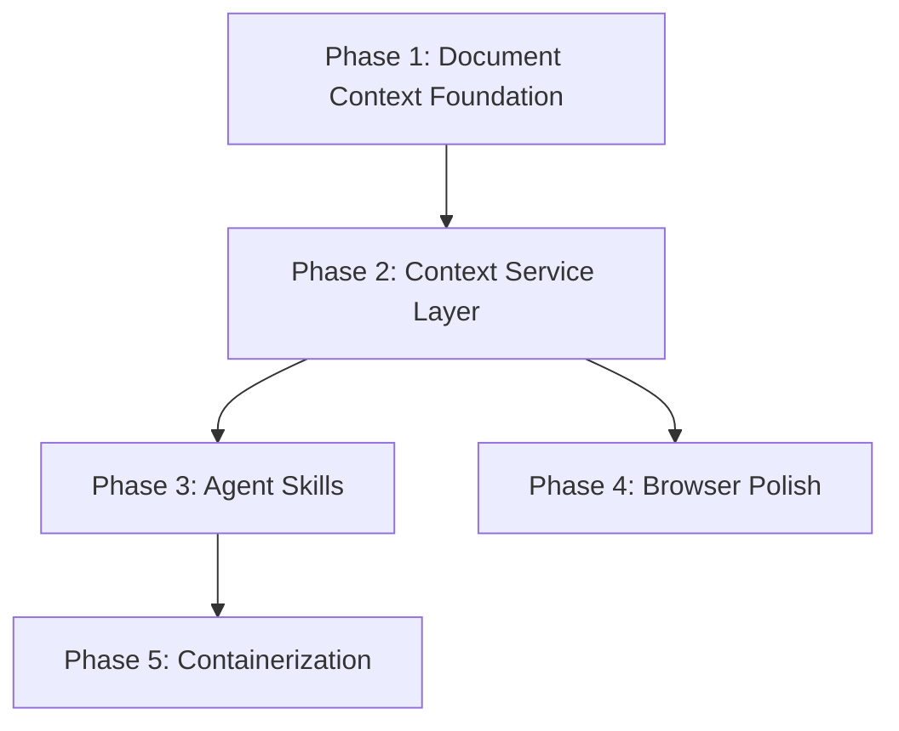

# Expansion Implementation Roadmap (Dec 2025, updated Feb 2026)

## 🧩 The Puzzle Strategy
This roadmap bridges the gap between the current "Partial Beta" state and the full November Expansion vision. It prioritizes **Foundational Reliability** (Database, Services) over new shiny features (Skills, UI polish).

> **Architecture decision (Feb 2026):**
> Phases 1–2 originally assumed Google FileSearch RAG as the document retrieval approach. After analysis, the current plan is **Claude MCP Local Document Access** — a metadata-driven file lookup that feeds curriculum documents directly into Claude's context window. Google FileSearch is retained as a hypothesis for future evaluation. See [ENHANCED_GENERATION_AND_VOCABULARY_MODULES.md](./ENHANCED_GENERATION_AND_VOCABULARY_MODULES.md) for full rationale.

### 🚦 Critical Path

---

## 📅 Phases & Status

### Phase 1: Document Context Foundation ( IMMEDIATE PRIORITY )
**Goal**: Establish the foundation for curriculum-aware lesson plan generation using local document access.

**Approach**: Instead of a managed RAG service (Google FileSearch), use the existing well-structured document corpus (`strategies_pack_v2/`, `wida/`, `co_teaching/`) with metadata-driven lookup. The documents are already organized by grade cluster, subject, proficiency level, strategy category, and lesson type — making deterministic file selection effective without semantic vector search.

**Why this fits our scale**: 2 teachers, ~14 structured JSON files, bounded curriculum. Entire corpus fits in Claude's context window. No external dependency needed.

- [ ] **Document inventory**: Catalog existing curriculum documents and their metadata dimensions (grade, subject, proficiency, category).
- [ ] **Schema stability**: Ensure `OriginalLessonPlan` and `lesson_json` are stable (Already ✅).
- [ ] **Design retrieval logging**: Define what to track when documents are used during generation (which files, why selected, token estimates) — for auditing and debugging.

### Phase 2: Context Service Layer (High Priority)
**Goal**: Build the service that selects and loads the right documents for a given lesson context.

- [ ] **Service: `CurriculumContextService`**: Implement metadata-driven document lookup (`backend/services/curriculum_context_service.py`). Given a query profile (grade, subject, proficiency levels, lesson type), select and return matching documents.
- [ ] **Integration**: Wire the service into the existing `batch_processor.py` generation flow so Claude receives curriculum context alongside the primary plan content.
- [ ] **Indexing script**: Create a script to populate the document registry from the existing `strategies_pack_v2/`, `wida/`, and `co_teaching/` directories.

> **Future option (Google FileSearch hypothesis):** If the document corpus grows significantly or semantic search becomes necessary, revisit Google FileSearch as documented in [ENHANCED_GENERATION_AND_VOCABULARY_MODULES.md](./ENHANCED_GENERATION_AND_VOCABULARY_MODULES.md). Triggers: corpus > ~200 documents, arbitrary PDF uploads, queries that metadata can't resolve.

### Phase 3: Agent Skills & Optimization (Medium Priority)
**Goal**: Enable the "Weekly Architect" and "Lesson Generator" to use the new context foundation.

- [ ] **Skill: `lesson-plan-generation`**: Implement MCP skill to generate plans using `CurriculumContextService`.
- [ ] **Skill: `weekly-architect`**: Implement skill to analyze `OriginalLessonPlan` data for weekly coherence.
- [ ] **Testing**: Verify "Code Execution" approach for generating plans.

### Phase 4: Browser Consensus (Medium Priority)
**Goal**: Bring the "Partial" Browser module to full spec.

- [ ] **Filtering**: Add Subject/Grade/Time filtering to `LessonPlanBrowser.tsx`.
- [ ] **Navigation**: Implement "Schedule Order" logic explicitly in the UI.
- [ ] **Polish**: Fix "Jump to content" to align with plan slots vs schedule slots.

### Phase 5: Infrastructure & Sync (Low Priority / Future)
**Goal**: Scale up for more users or complex workloads.

- [ ] **Workers**: Containerize `image_collector` and `audio_generator` (Redis/Celery).
- [ ] **P2P Sync**: Implement vector clocks and sync protocol.
- [ ] **Mobile**: Port Browser features to React Native (if not using shared webview).

---

## 🛠 Usage
Use this roadmap to track progress. Each item corresponds to a specific task in `task.md`.
**Do not skip phases**. Building Skills (Phase 3) without the Context Foundation (Phase 1/2) will lead to failure.
