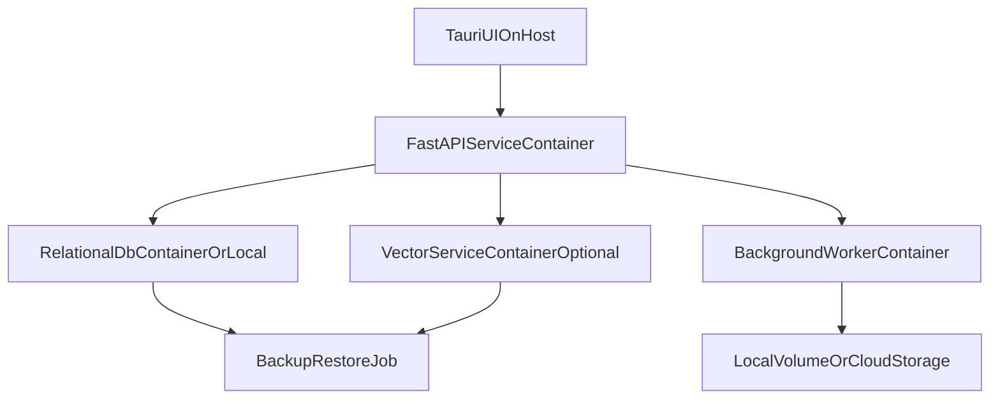

# LP2 Containerization and Portability Strategy

Status: Proposed
Last updated: 2026-04-23

## Decision Goal
Pick the containerization baseline for LP2 using evidence, not preference, while preserving desktop-app realities (Tauri host UI + local service plane).

## Context
- Current app is desktop-first (Tauri + FastAPI).
- Existing roadmap already recommends selective containerization and defers Kubernetes.
- LP2 must improve portability and machine-to-machine reproducibility.

## Options Evaluated

### OptionA_DockerComposeFirst
- Use `docker compose` for backend/services/database/vector dependencies.
- Keep Tauri UI native on host.
- Strong for reproducible multi-service local stacks and CI parity.

### OptionB_DevContainerFirst
- Standardize developer environment with `devcontainer.json`.
- Can reference compose for dependencies.
- Strong for onboarding and toolchain consistency.

### OptionC_KubernetesReadyNow
- Build for cluster orchestration from day one.
- High complexity and low immediate value for current team scale/use case.

## Recommendation
Adopt a **layered baseline**:
1. **Primary:** `Docker Compose first` for service plane portability and local/CI consistency.
2. **Secondary:** `Dev Container` profile for standardized developer tooling.
3. **Deferred:** Kubernetes unless explicit scale and orchestration triggers are met.

This aligns with both existing roadmap context and external best practice for desktop+services setups.

Note: this strategy defines the target architecture and gates for LP2, but does not start physical LP2 clone execution during the reflection period.

## Target Architecture

## Portability Baseline Requirements
- Single command stack startup for services.
- Version-pinned base images.
- Health checks on all stateful services.
- Named volumes and documented backup/restore.
- Environment template with strict secrets boundary.

## Decision Gates
- Gate 1: local startup reliability across target dev machines.
- Gate 2: onboarding time target met for new developer machine.
- Gate 3: restore drill succeeds from backup artifacts.
- Gate 4: CI reproduces same service topology and test pass rate.

## Deferred Work
- Kubernetes manifests and cluster-level tooling remain out of scope until:
  - multi-node need is confirmed,
  - or uptime/scaling requirements exceed compose capabilities.
