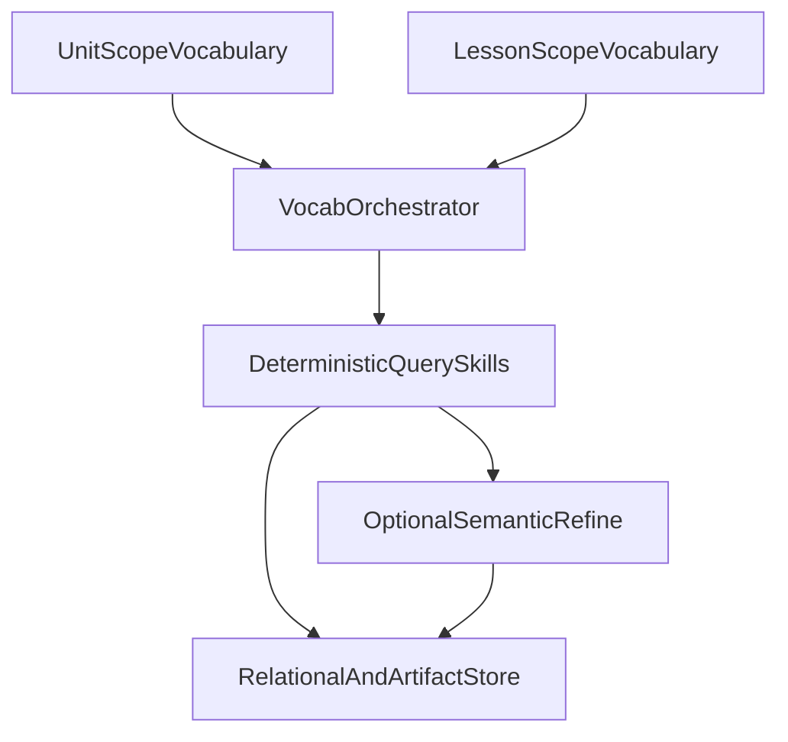

# Vocabulary Agent, Multi-API Enrichment, and Hybrid Data

Status: Planning
Last updated: 2026-04-24

**Related:** [ENHANCED_GENERATION_AND_VOCABULARY_MODULES.md](./ENHANCED_GENERATION_AND_VOCABULARY_MODULES.md) (vocabulary module, key tables, image/audio APIs), [REFERENCE_DOCS_AND_LESSON_PLAN_ACCESS.md](./REFERENCE_DOCS_AND_LESSON_PLAN_ACCESS.md) (retrieval contract, structure over fuzzy-only RAG), [LP2_DATABASE_DECISION_GATES.md](./LP2_DATABASE_DECISION_GATES.md) and [ARCHITECTURE_GATE_OPTION_MATRIX.md](./ARCHITECTURE_GATE_OPTION_MATRIX.md) (relational + vector patterns, gated engine choice).

## 1. Problem framing: unit scope vs lesson scope

The vocabulary module is expected to work in **more than one mode**:

- **Unit-level (aggregate):** Read one grade/subject **unit** as a whole to determine **main vocabulary for the unit**: cross-lesson theme terms, high-leverage domain vocabulary, and a coherent set for word walls, spiral preview, or unit framing. This may require scanning all lessons in the unit plus unit-level curriculum fields.
- **Lesson-level (part of unit):** For a **single lesson**, determine the **tight** vocabulary set for that day (e.g. objectives-aligned terms, v4-style six EN–L1 pairs, slot-specific lists).

**How they combine:** A typical flow is: unit pass establishes a **backbone** (prioritized, deduplicated candidates); each lesson run narrows or extends that set with day-specific terms. Both steps should resolve **the same** curriculum SSOT (unit id, lesson ids, ordering) before any external API calls, to avoid inconsistent enrichment.

## 2. Hybrid queries: structured (non-semantic) vs semantic

**Structured (non-semantic) queries** are the default. They use deterministic keys and filters, for example:

- `grade`, `subject`, `unit_id`, `lesson_id`, `school_year`, language code
- Vocabulary `source` tags (glossary import, internal bank, API snapshot)
- Joins from `vocabulary_items`, `vocabulary_usages`, and curriculum tables in `curriculum.db` (see [CURRICULUM_EXTRACTION_ARCHITECTURE.md](../../scrapers/CURRICULUM_EXTRACTION_ARCHITECTURE.md))

**Semantic (embedding) search** is **optional** and only where metadata alone is not enough (e.g. "terms related to a concept" within a **pre-filtered** unit). It must follow the roadmap principle of **metadata pre-filters** before similarity, as in [REFERENCE_DOCS_AND_LESSON_PLAN_ACCESS.md](./REFERENCE_DOCS_AND_LESSON_PLAN_ACCESS.md) and [CURRICULUM_JSON_DATABASE_ETL.md](./CURRICULUM_JSON_DATABASE_ETL.md), to limit cross-grade or cross-subject leakage.

**Anti-patterns:**

- Open-ended semantic search for lesson vocabulary without grade/subject/unit guardrails
- Using embeddings as a substitute for resolving the correct `lesson_id` or `unit_id` from SSOT

## 3. External data plane: many APIs and sources

The existing design already references Merriam-Webster, EN–PT dictionary flows, image APIs, TTS, and glossaries. As the module matures, **additional categories** of integration are in scope, each with **planning** concerns (licensing, rate limits, terms of use, attribution) before implementation:

| Category | Purpose | Storage SSOT (conceptual) | Notes |
|----------|---------|---------------------------|--------|
| Dictionary / lemma (e.g. Merriam-Webster) | Definitions, part of speech, usage examples | `vocabulary_items` + **artifact** row for raw response | Caching, dedupe by `(lemma, source, request_hash)` |
| EN–L1 and future L1s | Translations, locale variants | `vocabulary_translations` or fields on items + artifacts | One row per (item, L1) where needed |
| **Phonology / phonetics** | IPA, syllables, stress where sources provide them | Optional columns or child table, plus artifacts | May require TTS or specialized APIs; **fallback** when a source has no IPA |
| **Cognate** and cross-lingual analysis | Pairs, false-friend flags, pedagogical notes | Bank fields + `source` | May combine reference glossaries (e.g. RBERN) with heuristics |
| **Wiktionary or similar** | Open lexical data, etymology (planning) | **Never** the sole SSOT; snapshot or API response in artifact store with **attribution** | Favor official APIs, dumps, or read-only access per license; no scraping spec here |
| TTS / pronunciation | Audio for EN/L1 | Media URIs + cache; optional link to phoneme set | Existing audio skill path in [ENHANCED_GENERATION_AND_VOCABULARY_MODULES.md](./ENHANCED_GENERATION_AND_VOCABULARY_MODULES.md) |
| Image search | Vocabulary cards, games | Normalized image cache as today | Unsplash, Pixabay, etc. |

**API orchestration (design intent):** A small **dictionary / enrichment service** should centralize rate limiting, caching, error handling, and normalization. Raw payloads belong in a **separate concern** from the human-facing `vocabulary_items` text so the bank stays editable and auditable.

## 4. Vocabulary orchestrator and skills (conceptual)

Most of the **implementation effort** is expected in **orchestrated agents and skills** plus the **data model**, not a single monolithic LLM call.

- **Orchestrator:** Decides whether the run is **unit-scoped** or **lesson-scoped** (or both in sequence), wires skills, and enforces validation gates (schema, WIDA level definitions present, teacher approval when required).
- **Skills (dimensions), examples:**
  - Resolve curriculum context (unit, lessons) from SSOT
  - **Build six WIDA-level English definitions** per term (dedicated path + validation; see [ENHANCED_GENERATION_AND_VOCABULARY_MODULES.md](./ENHANCED_GENERATION_AND_VOCABULARY_MODULES.md))
  - Fetch/merge dictionary and translation artifacts
  - **Fetch or infer phonological** fields when the design requires them (store what is available; document gaps)
  - Link cognates and glossary-sourced terms
  - Attach images/audio per existing pipelines
  - **Persist** relational rows and immutable **source artifacts**

## 5. Database: stronger than a single thin vocabulary table

The original sketch (`vocabulary_items`, usages, approvals, image cache) remains the **core bank**. A **robust** store for the agentic vocabulary path likely also needs:

- **Provenance and artifacts:** raw JSON (or text) from APIs, `source`, `fetched_at`, `content_hash` (or equivalent), and optional **TTL/refresh** policy
- **Deduping** at the artifact or request level to control cost and rate limits
- **Optional** embedding columns or a small vector side table for semantic refinement **only** with metadata filters
- Sufficient **concurrency and history** for multi-step agent writes (the exact engine—MariaDB, Postgres+pgvector, or hybrid—is **gated**; see [LP2_DATABASE_DECISION_GATES.md](./LP2_DATABASE_DECISION_GATES.md))

**SQLite** may remain sufficient for early spikes; at scale, heavy concurrent enrichment and long artifact history may push toward a **gated** server-grade or hybrid deployment. This document does not choose a vendor.

## 6. Linguistic dimensions, language functions, and source research

Before locking the vocabulary **schema** and **API shortlist**, the project needs a **deliberate study** that reads the relevant internal and external documentation to answer: which **linguistic dimensions** and **language functions** must the database support so agents can build grounded materials for multilingual learners?

**Internal inputs (non-exhaustive):** WIDA-oriented lesson plans ([docs/prompt_v4.md](../../prompt_v4.md) and strategy/WIDA JSON SSOT), [WIDA_FRAMEWORK_INGESTION_AND_USE.md](./WIDA_FRAMEWORK_INGESTION_AND_USE.md), vocabulary pedagogy in [ENHANCED_GENERATION_AND_VOCABULARY_MODULES.md](./ENHANCED_GENERATION_AND_VOCABULARY_MODULES.md) (e.g. everyday vs cross-disciplinary vs technical, collocations, morphology), [CMI5_PACKAGE_GENERATION.md](./CMI5_PACKAGE_GENERATION.md) and [AGENTIC_CMI5_DESIGN_RULES.md](./AGENTIC_CMI5_DESIGN_RULES.md) for what cmi5 and activities must **consume** from the bank. The study should output a **matrix**: dimension or function (e.g. key language use, ELD domain, register, cognate status, frequency band) → **required fields** in the data model → **optional** vs **required** for MVP.

**External source research:** For each dimension the matrix requires, identify the **best** combination of **libraries, dictionaries, and public APIs** (or licensed corpora) from which to **collect** definitions, translations, IPA/phonology, etymology, sense disambiguation, and cross-lingual links—subject to **licensing, rate limits, stability, and attribution**. This is not a one-size-fits-all: different subjects (math register vs ELA) may lean on different providers; the [external data plane](#3-external-data-plane-many-apis-and-sources) table is the high-level map; the study fills in **candidates and evaluation criteria**.

**Why the study pays off:** A vocabulary database with **rich, consistent metadata and robust linguistic elements** is the foundation for **agents** to generate high-quality **cmi5** packages, **classroom activities**, **visual and graphic organizers**, and other pedagogy that stays **grounded in language and content**—not generic text—so supports for multilingual students stay coherent from the word list through to delivery formats.

**Guardrails:** YAGNI for fields no downstream consumer needs yet; SSOT for teacher-facing text vs **API artifacts**; re-run the source matrix when WIDA or district assessment docs (e.g. Newark-style) are fully modeled in the store.

## 7. Phonological and phonetic information

For **unit-level** work and **cognate** instruction, stored **IPA**, syllabification, or other phonological fields improve consistency across lessons. Plan for:

- **Storing** what each integrated source actually returns
- **Explicit nulls** when a source has no data (avoid silent invention in the database)
- **TTS** as a complementary signal for pronunciation when IPA is missing (policy to be defined in implementation)

## 8. Checklist (documentation-only)

- [ ] Enumerate target APIs and sources in an implementation spec (legal review per source).
- [ ] Define artifact table shape and migration in schema phase (reference [Database Schema Changes](ENHANCED_GENERATION_AND_VOCABULARY_MODULES.md#database-schema-changes) in the main doc when ready).
- [ ] Align orchestrator contract with [AGENT_SKILLS_AND_CODE_EXECUTION.md](./AGENT_SKILLS_AND_CODE_EXECUTION.md) skill boundaries.
- [ ] Run database architecture gate when enrichment volume and concurrency requirements are known.
- [ ] Complete linguistic dimensions / language-functions matrix and source evaluation (see [section 6](#6-linguistic-dimensions-language-functions-and-source-research)).
