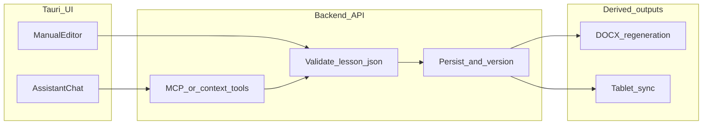

# Lesson Plan Editor – Dual-edit architecture

> **Pre-research draft.** This document is a structural placeholder. Final decisions on rich-text storage, patch format, and versioning **must** follow [01_research_memo.md](./01_research_memo.md) Phase D. Until then, treat sections marked TBD as open.

## 1. Principles

- **`lesson_json` is SSOT** for lesson content after generation; exports (DOCX, objectives PDF, etc.) are **derived** and regenerated or marked stale after a successful save.
- **One save pipeline** for manual and assistant edits: validate, persist, version (as designed), trigger export/sync hooks.
- **Assistant** does not silently overwrite: teacher **accepts** a proposed change set (exact UX in [05_ui_ux_spec.md](./05_ui_ux_spec.md)).

## 2. Conceptual data flow

## 3. Components (TBD detail)

| Layer | Responsibility |
|-------|----------------|
| Manual editor | Bind selected fields to UI; optional rich-text model TBD |
| Assistant panel | Send instruction + context to backend; render diff or preview; Apply/Reject |
| Backend | Validate against schema; persist; optional MCP/context for grounding |
| Renderer | Consume saved `lesson_json` for DOCX and related artifacts |

## 4. Open questions

- Which **fields** are editable in v1 (whole slot vs subsection list)?
- **Rich text** encoding in JSON: plain only vs HTML subset vs structured nodes (see research memo).
- **Versioning** schema: new table vs column bump vs append-only history.
- **Conflict policy** when tablet and PC both edited (link sync doc).

## 5. Decisions (fill after Phase D)

| Topic | Decision | Date |
|-------|----------|------|
| Rich text | TBD | |
| Assistant patch format | TBD | |
| API boundary for LLM | TBD | |
