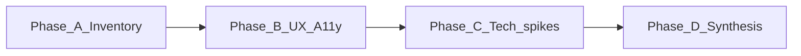

# Pedagogical tooltips and popovers (research bundle)

**Status:** Research (documentation only; no product implementation in this phase)  
**Purpose:** Support informed decisions on in-app **strategy** and **WIDA** explanations when teachers view lesson content in the browser (Lesson Plan Browser, Lesson Mode).

---

## Scope

- **In scope:** Hover or click affordances that surface definitions from existing single sources of truth: the bilingual strategy pack under [`strategies_pack_v2/`](../../../../strategies_pack_v2/README.md) and WIDA reference material such as [`wida/wida_framework_reference.json`](../../../../wida/wida_framework_reference.json).
- **Primary surfaces:** Shared UI that renders `lesson_json` (e.g. [`shared/lesson-browser/src/components/LessonDetailView.tsx`](../../../../shared/lesson-browser/src/components/LessonDetailView.tsx), [`shared/lesson-mode/src/components/resources/LessonPlanDisplay.tsx`](../../../../shared/lesson-mode/src/components/resources/LessonPlanDisplay.tsx)).

## Non-goals (YAGNI for this research phase)

- Implementing React components or adding npm dependencies (deferred until after the gate below).
- Changing LLM prompts, [`schemas/lesson_output_schema.json`](../../../../schemas/lesson_output_schema.json), or DOCX/PDF pipelines unless research explicitly identifies a schema need.
- Full WIDA PDF ingestion (see separate roadmap item); this feature may use the existing JSON reference and, later, richer slices from [WIDA framework ingestion](../WIDA_FRAMEWORK_INGESTION_AND_USE.md).

---

## Related roadmap and policy

| Document | Relevance |
|----------|-----------|
| [WIDA_FRAMEWORK_INGESTION_AND_USE.md](../WIDA_FRAMEWORK_INGESTION_AND_USE.md) | Longer-term structured WIDA content; tooltips may stay on lightweight JSON until ingestion matures. |
| [REFERENCE_DOCS_AND_LESSON_PLAN_ACCESS.md](../REFERENCE_DOCS_AND_LESSON_PLAN_ACCESS.md) | How reference material is exposed to humans vs LLMs; align tooltip copy with the same SSOT principles. |
| [LESSON_PLAN_BROWSER_MODULE.md](../LESSON_PLAN_BROWSER_MODULE.md) | Browser UX context; touch and classroom use. |
| [DOCUMENTATION_POLICY.md](../../../DOCUMENTATION_POLICY.md) | Roadmap vs archive; this folder stays under `docs/roadmap/design/`. |

---

## Research phases

| Phase | Document | Activity |
|-------|------------|----------|
| A | [02_data_inventory_and_matching.md](./02_data_inventory_and_matching.md) | Map `lesson_json` string fields and SSOT fields; identify matching risks. |
| B | [01_research_questions_and_success_criteria.md](./01_research_questions_and_success_criteria.md), [03_ux_accessibility_and_platform_notes.md](./03_ux_accessibility_and_platform_notes.md) | Lock questions, success criteria, UX and a11y constraints. |
| C | [04_technical_spikes_checklist.md](./04_technical_spikes_checklist.md) | Time-boxed spikes (libraries, markdown interplay, bundling). |
| D | [05_decision_log.md](./05_decision_log.md) | Record decisions and pointers to evidence. |
| E (ongoing) | [06_online_research_notes.md](./06_online_research_notes.md) | External sources: libraries (Radix, Floating UI, React Aria, etc.), WCAG/APG patterns, answers mapped to `01` questions. |

---

## Gate: implementation readiness

Do **not** treat implementation as approved until all of the following are true:

1. **Data:** [02_data_inventory_and_matching.md](./02_data_inventory_and_matching.md) lists target fields and a chosen matching strategy (structured-only vs prose), with known false-positive risks documented.
2. **UX/a11y:** [03_ux_accessibility_and_platform_notes.md](./03_ux_accessibility_and_platform_notes.md) specifies interaction model for pointer vs keyboard vs touch and minimum accessibility expectations.
3. **Technical:** [04_technical_spikes_checklist.md](./04_technical_spikes_checklist.md) has each spike row completed with pass/fail or result notes.
4. **Decisions:** [05_decision_log.md](./05_decision_log.md) records library and behavior choices with rationale.

When the gate is met, add a short **Implementation readiness summary** subsection here (or create a dedicated `06_implementation_readiness.md`) with a single paragraph and links to the decision log. (**Note:** [06_online_research_notes.md](./06_online_research_notes.md) is for ongoing external research, not the implementation gate summary.)

---

## Document index

| File | Description |
|------|-------------|
| [01_research_questions_and_success_criteria.md](./01_research_questions_and_success_criteria.md) | Questions and measurable success criteria |
| [02_data_inventory_and_matching.md](./02_data_inventory_and_matching.md) | Schema and fixture inventory; matching approaches |
| [03_ux_accessibility_and_platform_notes.md](./03_ux_accessibility_and_platform_notes.md) | Tooltip vs popover, Tauri WebView, a11y |
| [04_technical_spikes_checklist.md](./04_technical_spikes_checklist.md) | Spike checklist and results |
| [05_decision_log.md](./05_decision_log.md) | Dated decisions |
| [06_online_research_notes.md](./06_online_research_notes.md) | Libraries, WCAG/APG citations, mapped answers to `01` questions |
