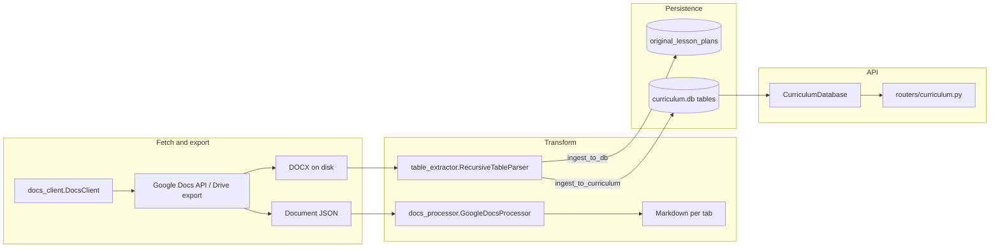

# Curriculum extraction architecture

This document describes how curriculum content moves from Google Docs / DOCX into SQLite and the API. For schema ownership, see [tools/db/CURRICULUM_SCHEMA_SSOT.md](../../tools/db/CURRICULUM_SCHEMA_SSOT.md) and [ADR-002: Curriculum SQLite schema SSOT](../decisions/ADR-002-curriculum-schema-ssot.md).

## End-to-end flow

## Module responsibilities

| Module | Role |
|--------|------|
| [tools/scraper/main.py](../../tools/scraper/main.py) | CLI orchestration: recursive doc walk, export HTML/DOCX/JSON, markdown tabs, optional `ingest_to_db` when `--user_id` is set. |
| [tools/scraper/docs_client.py](../../tools/scraper/docs_client.py) | OAuth client: `get_document`, `export_document`, `get_document_json`. |
| [tools/scraper/docs_processor.py](../../tools/scraper/docs_processor.py) | Google Docs JSON to markdown; tabs and nested tabs; inline image placeholders. |
| [tools/scraper/crawler.py](../../tools/scraper/crawler.py) | Link extraction and classification from doc JSON for recursion. |
| [tools/scraper/table_extractor.py](../../tools/scraper/table_extractor.py) | DOCX parse: recursive tables, hyperlinks, semantic stream; `ingest_to_curriculum` (lessons/standards/vocab/resources); `ingest_to_db` (extraction cache). |
| [tools/scraper/subject_config.py](../../tools/scraper/subject_config.py) | Subject-specific lesson title regexes and section anchor strings. |
| [backend/database/curriculum.py](../../backend/database/curriculum.py) | Reads/writes `curriculum.db` for explorer, lessons, unit intro, vocabulary, resources. |
| [backend/database/curriculum_validation.py](../../backend/database/curriculum_validation.py) | Validates required tables/columns before curriculum routes run. |
| [backend/routers/curriculum.py](../../backend/routers/curriculum.py) | REST endpoints for curriculum explorer and lesson detail. |

## Two ingestion modes (do not conflate)

1. **`RecursiveTableParser.ingest_to_db(docx_path, metadata)`**  
   - Target: application **lesson-plans** SQLite (same default as `SQLiteDatabase()`, not `curriculum.db`), table **`original_lesson_plans`**.  
   - Purpose: structured extraction cache (JSON + `full_text`) for downstream processing.  
   - Writer: [backend/database/plans.py](../../backend/database/plans.py) via `SQLiteDatabase.create_original_lesson_plan`.

2. **`RecursiveTableParser.ingest_to_curriculum(docx_path, unit_id, subject)`**  
   - Target: **`curriculum.db`** (path configurable on `CurriculumDatabase`).  
   - Purpose: normalized curriculum graph: `units` / `lessons` / `standards` / `vocabulary_*` / `resources` / junction tables.  
   - Used by scraper batch scripts and [test_full_ingestion.py](../../tools/scraper/test_full_ingestion.py), not by the default `main.py` recursive flow.

## Operational notes

- **Linked Google Docs** may enrich `procedure_html` when `docs.google.com/document/d/...` links exist; Drive files and Slides are not DOCX-exportable and are skipped for recursion.  
- **Section routing** in `ingest_to_curriculum` depends on anchor strings in `SubjectConfig`; missing anchors can leave `procedure_html` empty until anchors or fallbacks are extended.  
- **Schema drift**: `upsert_lesson` filters columns against `PRAGMA table_info(lessons)`; unknown columns are omitted (warnings logged when keys are dropped).

## High-fidelity lesson fields (ingestion and API)

### `standards_structured` on `lessons`

During `flush_buffer`, the parser builds a JSON array of objects shaped like `{ "panel": "left"|"right", "section": string, "code": string, "description_lines": string[] }` from standards panels (NJ, MP, NCTM content/process). That JSON is stored on the lesson row as **`standards_structured`** (TEXT JSON) and written by `upsert_lesson` in [backend/database/curriculum.py](../../backend/database/curriculum.py). The curriculum API returns it on lesson detail; the explorer UI prefers it for standards layout when present. See also [backend/database/curriculum_validation.py](../../backend/database/curriculum_validation.py) (required column at API startup).

### ELA `ela_key_learning_summary` (Summary of Key Learning matrix)

For **`ingest_to_curriculum`** with **`subject="ELA"`**, the first DOCX table that matches the unit-level **Summary of Key Learning** layout (see `SubjectConfig.ELA_SUMMARY_TABLE` and [tools/scraper/ela_summary_table.py](../../tools/scraper/ela_summary_table.py)) is parsed into structured JSON per **lesson number** and stored on **`lessons.ela_key_learning_summary`**. That table is **not** flattened into the semantic stream, so its text is not duplicated into `procedure_html`. Per-lesson **detailed** tables are still flattened into the semantic stream **and**, when they match the **Lesson N:** grid (see [tools/scraper/ela_lesson_plan_table.py](../../tools/scraper/ela_lesson_plan_table.py)), are parsed into **`lessons.ela_lesson_plan_structured`** (JSON by section titles: learning intentions, NJSLS block, key practices, vocabulary/resources, procedures buckets, differentiation).

**Column-level SSOT (Grade 2–3 style matrix):** [ELA_SUMMARY_OF_KEY_LEARNING_STRUCTURE.md](./ELA_SUMMARY_OF_KEY_LEARNING_STRUCTURE.md).

### Standards vs procedure boundaries and buffers

- **Link and standards extraction** always iterate the **raw** paragraph buffer (`self._buffer`) so headings such as `Activity n:`, `Warm-up`, resource lines, and short section titles are not appended into standard descriptions.
- **HTML assembly** for most lesson columns may use a **merged** copy of the buffer: `merge_docx_soft_break_paragraphs` is applied only when the active section is in `_SOFT_BREAK_MERGE_SECTIONS` in [tools/scraper/table_extractor.py](../../tools/scraper/table_extractor.py). **`_standards_temp` is not in that set** (standards side panels are excluded from soft-break merge for HTML).
- **`_is_non_standard_heading`** prevents procedure/resource headings from being treated as standards text during merge heuristics where relevant.

### Procedure subheaders

Lines that match warm-up / numbered activity / cool-down / lesson or activity synthesis (see `_is_procedure_subheader` in `table_extractor.py`) force routing into **`procedure_html`** and are re-emitted as content so titles appear in the rendered HTML.

### Soft-break paragraph merge

`merge_docx_soft_break_paragraphs` joins adjacent DOCX paragraphs when Word split mid-sentence: the previous chunk has **no** sentence-ending punctuation and the next starts with a **lowercase** letter. **Two bullets are never merged.** Merge is **not** applied across procedure subheaders, non-standard headings, or known standards section title lines.

Lesson fields in **`_SOFT_BREAK_MERGE_SECTIONS`**: `narrative_html`, `purpose`, `procedure_html`, `learning_intentions`, `objectives_student`, `mlr`, `materials`, `vocabulary`, `instructional_resources`, `daily_instructional_task`, `success_criteria`, `essential_questions`, `lesson_narrative`.

### Vocabulary

The **Vocabulary** section populates the lesson’s **`vocabulary`** HTML field and drives term extraction into **`_vocabulary`** / relational **`lesson_vocabulary`** (and related `vocabulary_items` rows) during ingestion.

### Cross-links

- [tools/db/recreate_and_ingest_sample.py](../../tools/db/recreate_and_ingest_sample.py) — recreate DB, seed unit, ingest sample Math Unit 2 DOCX.  
- [backend/routers/curriculum.py](../../backend/routers/curriculum.py) — REST surface for explorer hierarchy and lesson detail.  
- [backend/database/curriculum_validation.py](../../backend/database/curriculum_validation.py) — schema gate for curriculum routes.

## Related docs

- [math_unit_structure_analysis.md](math_unit_structure_analysis.md) — observed DOCX grid patterns.  
- [tools/db/CURRICULUM_SCHEMA_SSOT.md](../../tools/db/CURRICULUM_SCHEMA_SSOT.md) — canonical curriculum tables.  
- [tools/scraper/verify_curriculum_db.py](../../tools/scraper/verify_curriculum_db.py) — post-ingestion integrity CLI.
- [tools/db/recreate_and_ingest_sample.py](../../tools/db/recreate_and_ingest_sample.py) — wipe/recreate `curriculum.db` from SSOT, seed reference unit, ingest sample DOCX (`--full-unit` for entire Unit 2 file).
